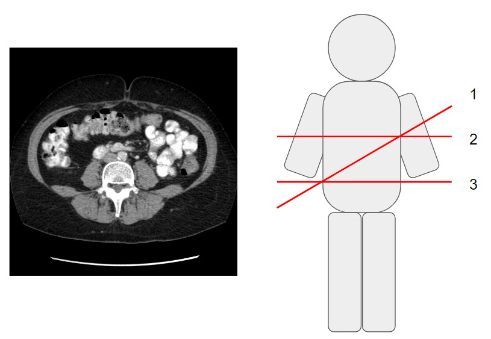
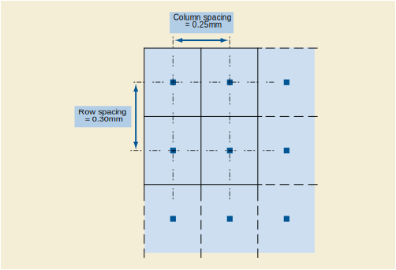

대부분[^1]의 단일 DICOM 이미지는 2차원 단면 이미지입니다.
CT나 MRI와 같은 3차원 영상도 많은 단면들이 각각 개별 DICOM 파일로 만들어지고 이를 하나의 시리즈로 묶어서 보게 되죠.
이 단면들로부터 3D recon (재구성)을 한다던가
[cross reference](https://www.radiantviewer.com/dicom-viewer-manual/cross-reference_lines.html) 기능을 구현하고자 한다던가
하는 3차원 공간 좌표에 대한 작업이 필요한 경우, 우리는 각 단면이 실제 3차원 공간에서 어떤 위치에 있었는지를 알아야 합니다.

## Image Plane Module

이 정보들을 담고 있는 게 바로 Image Plane Module입니다.
이 모듈에 포함된 태그들을 보죠.

|Attribute Name|Tag|Description|Example|
|--------------|:-:|-----------|-------|
|Pixel Spacing|(0028,0030)|각 픽셀의 중심들끼리의 물리적인 간격이며 숫자 쌍으로 표현 - `인접 행 간격 (구분자) 인접 열 간격` (mm)|`0.876953\0.876953`|
|Image Orientation (Patient)|(0020,0037)|첫 행과 열의 **방향 코사인**|`1.0\0.0\0.0\0.0\1.0\0.0`|
|Image Position (Patient)|(0020,0032)|좌상단 모서리 (전송된 첫 voxel의 중심)의 x, y, z 좌표 (mm)|`-208.200\-224.500\-127.250`|
|Slice Thickness|(0018,0050)|단면의 두께 (mm)|`2.500000`|
|Spacing Between Slices|(0018,0088)|인접한 단면 사이의 간격 (mm). 간격은 각 단면의 중심간의 거리로 측정|`2.500000`|
|Slice Location|(0020,1041)|이미지 평면의 상대적인 위치 (mm)|`-127.250`|

각 태그의 의미를 하나씩 살펴보도록 합시다.

### Pixel Spacing

### Image Orientation


### Image Position

### Slice Thickness / Spacing Between Slices

### Slice Location

[^1]: 아닌 예시로 [multiframe](http://dicom.nema.org/medical/Dicom/current/output/chtml/part03/sect_C.7.6.6.html) 이미지가 있습니다.
